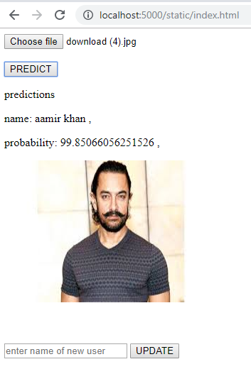

# Face Identification and Recognition using OpenFace  

This project leverages **dlib**, **OpenFace**, and **Keras** to perform face identification and recognition. The model extracts numerical embeddings from faces and classifies them using a deep learning model. It is deployed using **Flask** for real-time predictions.  

## Features  
- **Face Identification** using the **dlib** library  
- **Face Embeddings** generated using the **OpenFace** model  
- **Deep Learning-based Face Recognition** using a **Keras Sequential Model**  
- **Web Deployment** using **Flask**  

## Deployment Preview  
After deploying the Flask application, the interface looks as follows:  

  

## Required Libraries  
Ensure you have the following dependencies installed:  

- `pandas`  
- `flask`  
- `keras`  
- `dlib`  
- `pickle`  
- `PIL`  
- `base64`  
- `io`  
- `numpy`  
- `os`  

## How to Use  

Follow these steps to run the project:  

1. **Install Flask** and add it to your environment path  
2. **Clone the Repository**  
   ```sh
   git clone <repository-link>
   cd <repository-folder>
    ```
3. **Run the Flask Server**
    Open a terminal or command prompt in the project directory and execute:
    ```sh
    flask run --host=0.0.0.0
    ```
4. **Open the Application in a Browser**
    - Navigate to the provided localhost URL
    - Upload an image and predict!


This project demonstrates an end-to-end pipeline for face recognition, making it useful for security systems, biometric authentication, and other AI applications.

Let me know if you need any modifications! 🚀
